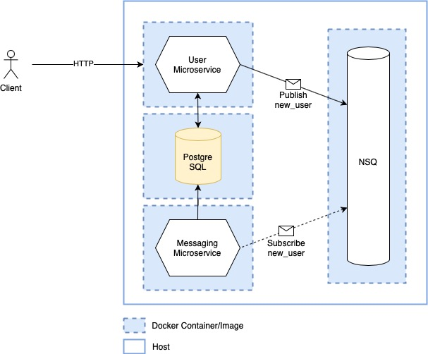

# go-microservices

Example simple microservices implementation with Go, Docker, PostgreSQL, NSQ



## Run
```
$ make run
```

## Ports
- App: `http://localhost:8080`
- Postgre Admin: `http://localhost:4171`
- NSQ Admin: `http://localhost:5050`